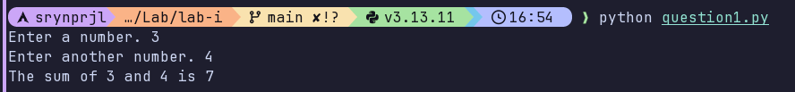
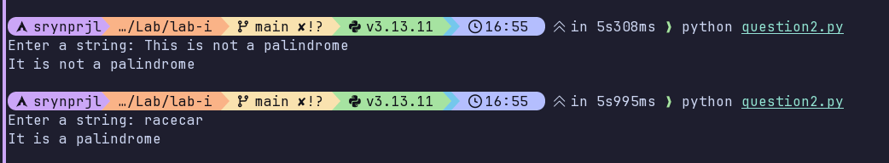
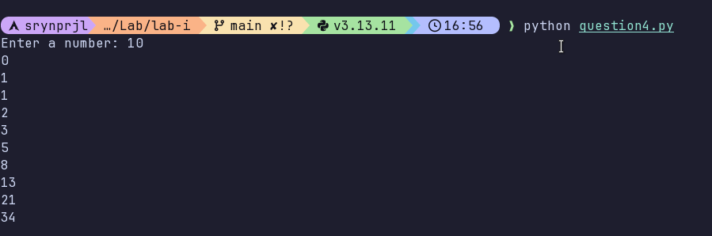
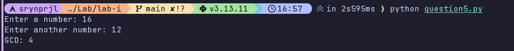
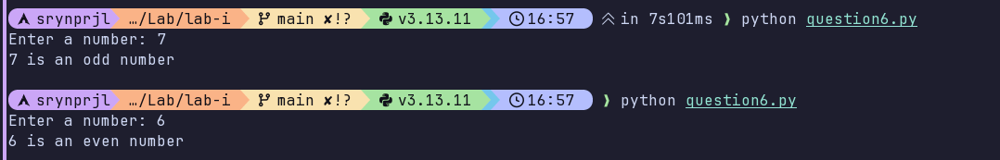
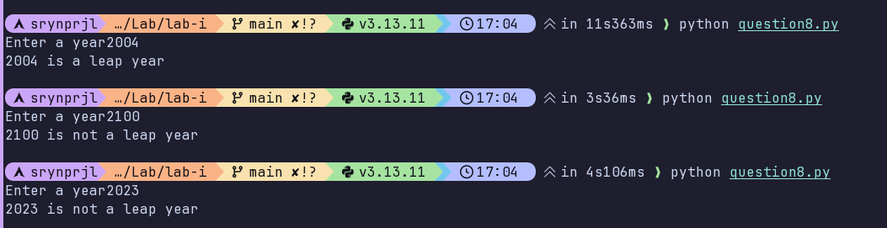
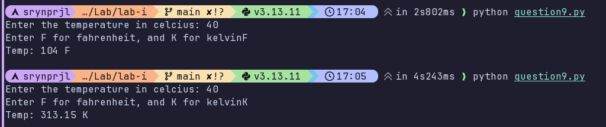
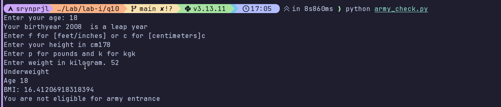

# Lab 1

[Question 1](./question1.py)  
Write a program that takes two numbers as input from the user, and print their sum.
 
**Output:**

[Question 2](./question2.py)  
Write a program that checks if a given string is palindrome.
 
**Output:**

[Question 3](./question3.py)  
Write a program that prints all prime numbers up to a given number ‘n’
 
**Output:**

[Question 4](./question4.py)  
Write a python program that prints the Fibonacci series up to n terms.
 
**Output:**

[Question 5](./question5.py)  
Define a function that takes two numbers as arguments, and returns their greatest common divisor (GCD).
 
**Output:**

[Question 6](./question6.py)  
Write a program that checks if a given number is even or odd.
 
**Output:**

[Question 7](./question7.py)  
Write a program that takes a list of numbers as input, and returns the largest number in the list.
 
**Output:**

[Question 8](./question8.py)  
Write a program that checks if a year is a leap year.
 
**Output:**

[Question 9](./question9.py)  
Write a program that takes a temperature in Celsius, and converts it to Fahrenheit and Kelvin, based on the choice of user.
 
**Output:**

[Question 10a](./q10/age.py)  
[Question 10b](./q10/bmi.py)  
[Question 10c](./q10/army_check.py)  

**Output**:

