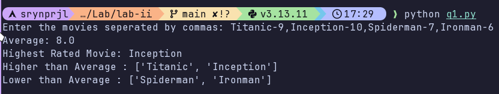
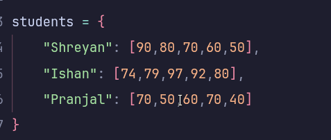
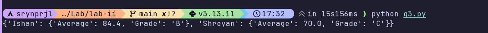
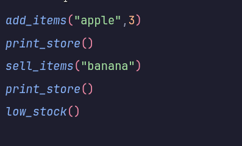
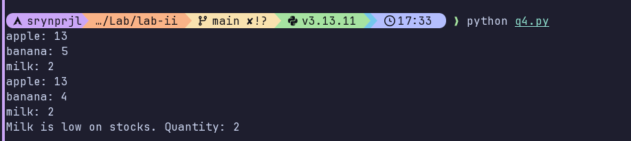
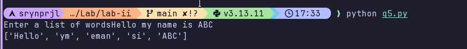
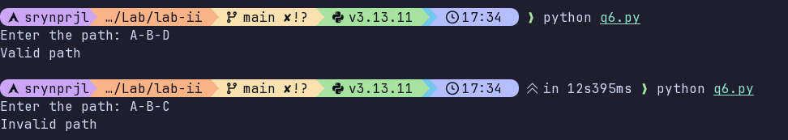

# Lab 2

[Question 1](./q1.py)  
Ask the user to input a list of movies with ratings like [("Titanic", 8), ("Inception", 9), ...]. Compute the average rating, find the highest-rated movie, and list all movies with rating above the average
**Output:**

[Question 2](./q2.py)  
Take a paragraph input from the user. Split it into words, remove duplicates, sort them alphabetically, and count the total number of unique words.
**Output:**

[Question 3](./q3.py)  
Store student names as keys and marks (list of integers) as values in a dictionary. Compute each student’s average and grade (A/B/C/D). Print the top 2 students based on average marks.
**Input**

**Output:**

[Question 4](./q4.py)  
Imagine a small store inventory like {"apple": 10, "banana": 5, "milk": 2}. Program should allowadding new items, selling items (subtract quantity), and print items that are low in stock (<3).
**Input**

**Output:**

[Question 5](./q5.py)  
Ask the user for a list of words. Reverse each word only if its length is even. Print the new list of words after processing.
**Output:**

[Question 6](./q6.py)  
Represent a small map as a dictionary like {"A": {"B", "C"}, "B": {"A", "D"}, "C": {"A", "D"}, "D": {"B", "C"}}. Ask the user to input a path, e.g., ["A", "C", "D"]. Check if each consecutive step is connected and print "Valid path" or "Invalid path"
**Output:**

