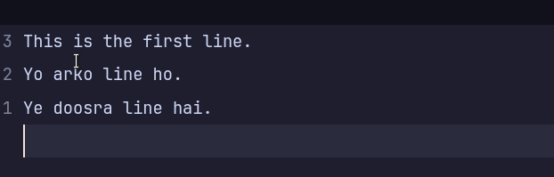
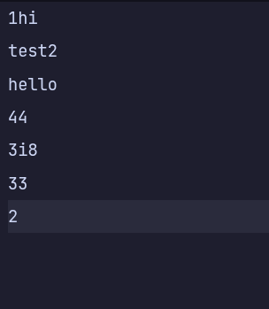
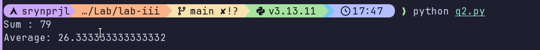
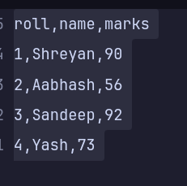
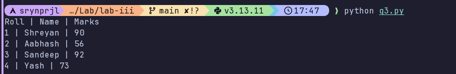
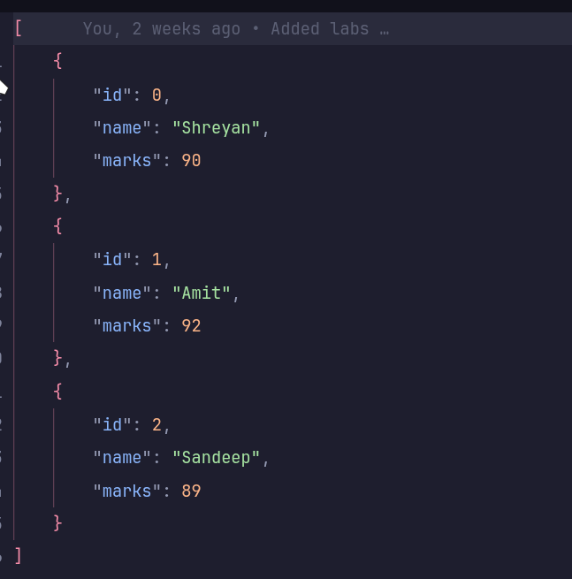
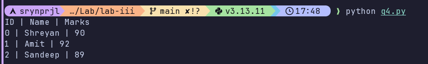
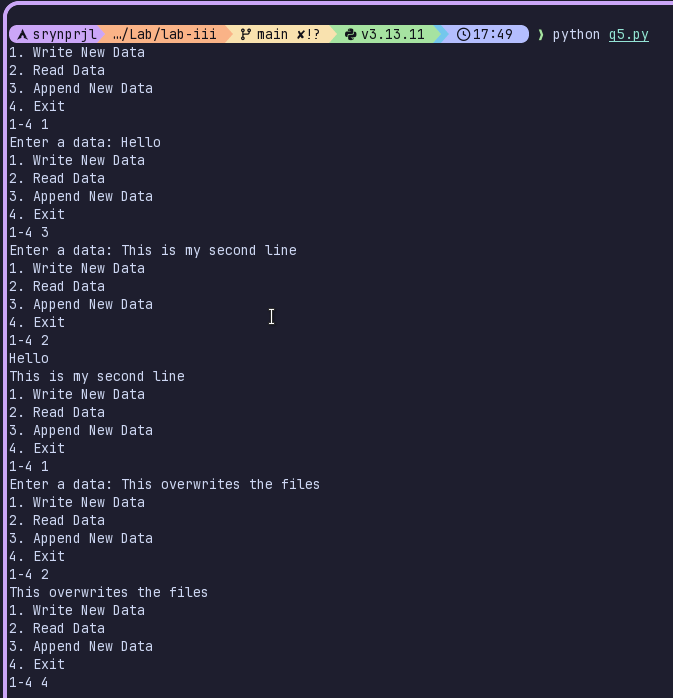

# Lab 3

[Question 1](./q1.py)  
Basic File Read & Write
- Create a text file and write multiple lines into it
- Read the contents of the file and display them on the screen
- Handle the case where the file does not exist using try-except 
**Output:**

[Question 2](./q2.py)  
File Processing with Exception Handling
- Reads numbers from a text file (one number per line)
- Ignores invalid entries using exception handling
- Calculates and displays the sum and average of valid numbers 
**Input**

**Output:**

[Question 3](./q3.py)  
1. CSV File Handling
- Read data from a CSV file containing student records (roll number, name, marks)
- Display all student records
- Handle file-related and data conversion errors using try-except 
**Input**:

**Output:**

[Question 4](./q4.py)  
1. Writing and Reading JSON Data
- Stores student details (ID, name, and marks) in a JSON file
- Reads the JSON file and displays the student information
- Handles exceptions related to file access and JSON decoding 
**Input:**

**Output:**

[Question 5](./q5.py)  
1. Menu-Driven File Operations
- Write data to a file
- Read data from a file
- Append data to a file
- Handle invalid user input and file errors using exception handling 

**Output:**

