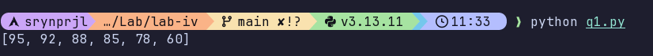
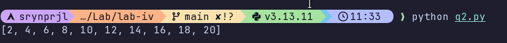
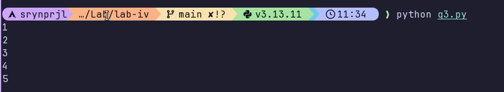
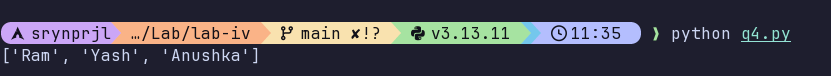
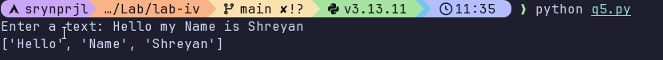
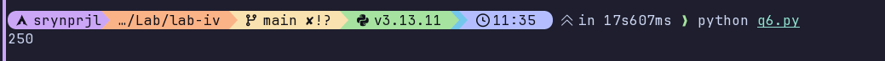

# Lab 4

[Question 1](./q1.py)  
Write a Python script that takes a list of student marks and sorts them in descending order (highest to lowest) using either the sorted() function or the .sort() method. 
**Code Explanation**:
In this script, we use the .sort() method or sorted() function to sort the list in ascending order. We use the keyword argument `reverse=` to make the list sort by highest to lowest (descending order). We can use any one of the two methods to sort the lists, but the difference between these two are `.sort()` changes the list , while `sorted()` returns a new list.

 
**Output**:

[Question 2](./q2.py)  
Use a list comprehension to create a new list containing only the even numbers between 1 and 20, demonstrating a more concise and readable alternative to traditional loops. 
**Code Explanation**:
This list comprehension generates even numbers by iterating through a range of 1 to 20 and using the condition x % 2 == 0 to filter for numbers divisible by two. It combines the creation, loop, and logic into a single line, making the code much more concise and readable than a standard for loop.

 
**Output**:

[Question 3](./q3.py)  
Create a generator function using the yield keyword that produces numbers from 1 to 5 one by one to illustrate how lazy evaluation can save memory when dealing with large datasets 
**Code Explanation**:
This script defines a generator function that uses the yield keyword to produce numbers from 1 to 5 lazily. Instead of returning a full list at once, it pauses after each number and only generates the next one when the for loop requests it. This makes the code highly memory-efficient compared to normal return functions, as it only processes one value at a time rather than storing the entire sequence.

 
**Output**:

[Question 4](./q4.py)  
Write a Python script that takes a list of six student names and uses the random.sample() function to randomly select exactly three "Volunteers" for a presentation, ensuring that no student is picked more than once in the selection. 
**Code Explanation**:
This script selects three unique volunteers by first using set() to remove any duplicate names from the students list and then using random.sample() to pick the names randomly. It includes a try-except block to catch a ValueError in case you attempt to select more volunteers than there are unique students available, ensuring the program doesn't crash.
 
**Output**:

[Question 5](./q5.py)  
Use the re module to write a script that searches through a paragraph and extracts all words that start with an uppercase letter (e.g., "London", "Python") to identify proper nouns or sentence starters 
**Code Explanation**:
This script uses the re.findall() function to search in a string for words that begin with an uppercase letter to find proper nouns or sentence starters. The regex `\b[A-Z][a-z]+\b` uses word boundaries (\b) to isolate specific words, requiring the first letter to be a capital letter ([A-Z]) followed by zero or more lowercase letters ([a-z]*). The findall() method selects all matching words and returns a list of all those words
 
**Output**:

[Question 6](../q6.py)
Given a list of student names and a list of their corresponding scores, use the zip() function to pair them together and then apply the reduce() function from the functools module to calculate the total sum of all scores. 
**Code Explanation**:
This script calculates the total sum of student scores by first combining names and marks into a single iterable and then processing them with a reduction logic. The zip() function pairs each name with its corresponding score, returning a set of tuples. Then, reduce() iterates through these pairs, using a lambda function to add each score (data[1]) to a running total (acc), starting from an initial value of 0. If no initial value is provided, it takes the first element as the accumulator and adds does lambdas operation to add all values.

 
**Output**:

